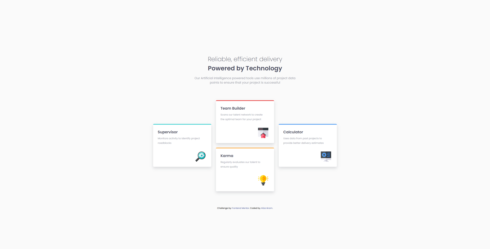
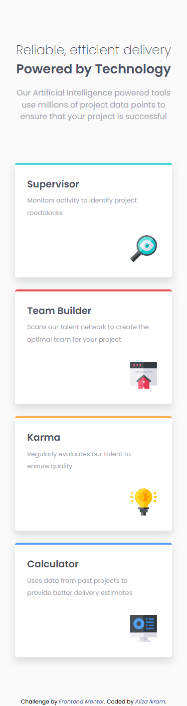

# Frontend Mentor - Four card feature section solution

This is a solution to the [Four card feature section challenge on Frontend Mentor](https://www.frontendmentor.io/challenges/four-card-feature-section-weK1eFYK). Frontend Mentor challenges help you improve your coding skills by building realistic projects.

## Table of contents

- [Overview](#overview)
  - [The challenge](#the-challenge)
  - [Screenshot](#screenshot)
  - [Links](#links)
- [My process](#my-process)
  - [Built with](#built-with)
  - [What I learned](#what-i-learned)
  - [Continued development](#continued-development)
  - [Useful resources](#useful-resources)
- [Author](#author)

## Overview

### The challenge

Users should be able to:

- View the optimal layout for the site depending on their device's screen size

### Screenshot

### Links

- Solution URL: [FrontEndMentor](https://www.frontendmentor.io/solutions/responsive-four-features-cards--bhIgVZ3EN)
- Live Site URL: [Netlify](https://github.com/AlizaIkram/four-card-feature-section)

## My process

### Built with

- Semantic HTML5 markup
- CSS custom properties
- Flexbox
- CSS Grid
- Mobile-first workflow

### What I learned

I learned using Grid layout efficiently and by combining the Mobile-first approach it became very easy to design this particular layout.

### Continued development

I'll continue to gain proficiency in using Grids and Mobile-first approach.

### Useful resources

- [Resource](https://www.joshwcomeau.com/css/interactive-guide-to-grid/) - This is an amazing article which helped me finally understand Grids. I'd recommend it to anyone still learning this concept.

## Author

- Linkedin - [Aliza Ikram](https://www.linkedin.com/in/aliza-ikram/)
- Frontend Mentor - [@AlizaIkram](https://www.frontendmentor.io/profile/AlizaIkram)

## Acknowledgments
